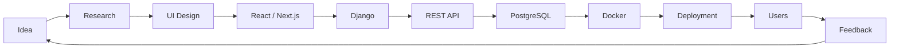
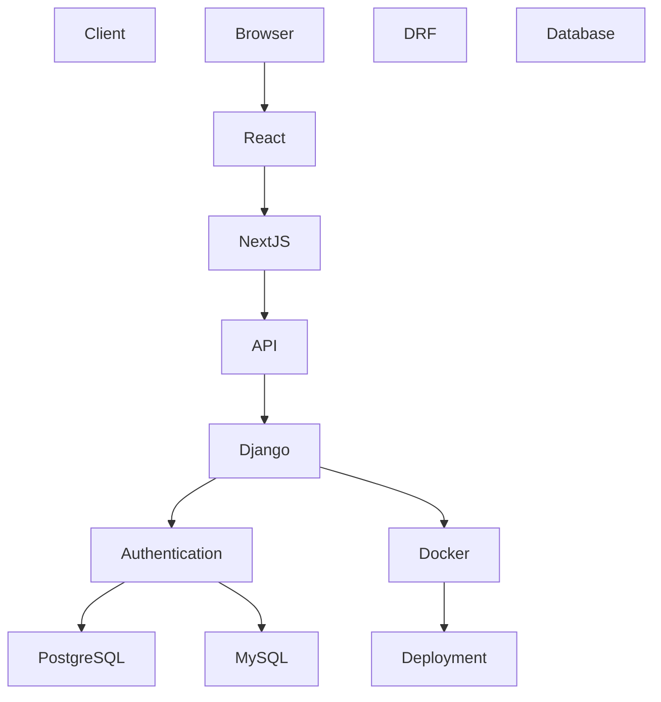
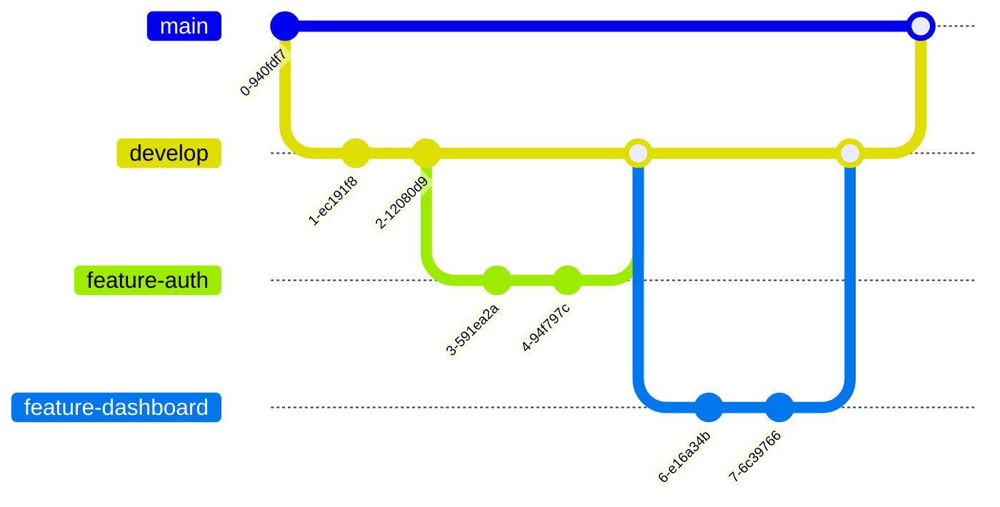
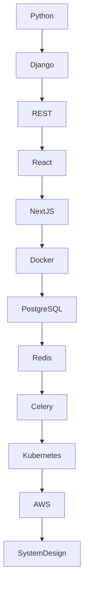
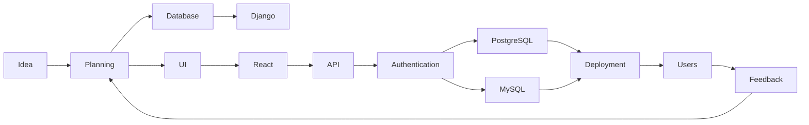
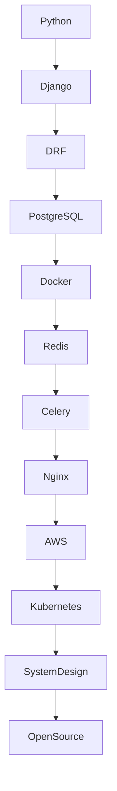

<!-- ========================================================= -->
<!--                     CYBERPUNK README                       -->
<!-- ========================================================= -->

<div align="center">


</div>

---

<div align="center">

#  Welcome to My Digital Universe

</div>

---

<div align="center">


</div>

---

<div align="center">


</div>

---

<div align="center">


</div>

---

# SYSTEM INITIALIZATION

```text
███████████████████████████████████████████

BOOTING CYBER TERMINAL...

Loading Profile...
████████████████████████ 100%

Loading Skills...
████████████████████████ 100%

Connecting GitHub...
████████████████████████ 100%

Connecting Blender...
████████████████████████ 100%

Building Future...
████████████████████████ 100%

SYSTEM STATUS

ONLINE

███████████████████████████████████████████
```

---

<div align="center">

## "Building elegant software one commit at a time."

</div>

---

# WHOAMI

```bash
> whoami

Name        : Aasish Karki

Role        : Full Stack Developer

Frontend    : React.js
              Next.js

Backend     : Django
              Django REST Framework

Language    : Python

Database    : PostgreSQL
              MySQL

Cloud       : Learning...

3D          : Blender

Mission     : Build software that people enjoy using.

Status      : Available for collaboration

Version     : v2026.8
```

---

<div align="center">

<table>

<tr>

<td width="50%">

# ABOUT

```yaml
name: Aasish Karki

location: Nepal

profession:

- Full Stack Developer
- Python Developer
- Blender Artist

currently_learning:

- Docker
- PostgreSQL
- System Design
- Next.js

currently_building:

- Django Applications
- REST APIs
- Interactive UI
- 3D Experiences

interests:

- Open Source
- UI Design
- Architecture
- Backend
```

</td>

<td width="50%">


</td>

</tr>

</table>

</div>

---

<div align="center">

# CYBER STATUS

</div>

<table>

<tr>

<td>

⚡ Backend

███████████████████░ 95%

</td>

<td>

🎨 UI

████████████████░░░ 88%

</td>

</tr>

<tr>

<td>

⚛ React

███████████████░░░░ 82%

</td>

<td>

🐍 Python

██████████████████░ 92%

</td>

</tr>

<tr>

<td>

🟩 Django

███████████████████ 95%

</td>

<td>

🎥 Blender

██████████████░░░░░ 80%

</td>

</tr>

</table>

---

<div align="center">


</div>

# CURRENT MISSION

<table>

<tr>

<td>

✔ Building production Django applications

</td>

<td>

✔ Learning advanced React

</td>

</tr>

<tr>

<td>

✔ Exploring Docker

</td>

<td>

✔ Improving UI Design

</td>

</tr>

<tr>

<td>

✔ PostgreSQL

</td>

<td>

✔ Blender Animations

</td>

</tr>

</table>

---

# DAILY WORKFLOW

```text
          PLAN
            │
            ▼
      DESIGN UI
            │
            ▼
   BUILD BACKEND
            │
            ▼
 CONNECT FRONTEND
            │
            ▼
      TEST APP
            │
            ▼
       DEPLOY
            │
            ▼
     IMPROVE AGAIN
```

---

# DEVELOPMENT PRINCIPLES

> Build clean.

> Build scalable.

> Build beautiful.

> Never stop learning.

> Simplicity beats complexity.

> User Experience comes first.

---

<div align="center">


</div>
<!-- ========================================================= -->
<!--                PART 2 — TECH STACK & ARCHITECTURE         -->
<!-- ========================================================= -->

<div align="center">

# ⚡ TECH ARSENAL

### Carefully chosen technologies for building fast, scalable, and beautiful applications.


</div>

---

<div align="center">

# LANGUAGES

<p>


</p>

</div>

---

<div align="center">

# FRONTEND

<p>


</p>

</div>

---

<div align="center">

# BACKEND

<p>


</p>

</div>

---

<div align="center">

# DATABASES

<p>


</p>

</div>

---

<div align="center">

# DEVOPS & CLOUD

<p>


</p>

</div>

---

<div align="center">

# DESIGN

<p>


</p>

</div>

---

<div align="center">

# FAVORITE TOOLS

| IDE | API | Browser | Terminal |
|:---:|:---:|:---:|:---:|
| VS Code | Postman | Firefox | PowerShell |

</div>

---

<div align="center">

# SKILL MATRIX

</div>

| Technology | Level |
|------------|-------|
| Python | ████████████████████ 95% |
| Django | ████████████████████ 95% |
| REST API | ██████████████████░ 90% |
| React | ████████████████░░░ 82% |
| Next.js | ██████████████░░░░░ 75% |
| PostgreSQL | █████████████░░░░░░ 70% |
| Docker | ███████████░░░░░░░░ 60% |
| Blender | ███████████████░░░░ 80% |
| UI Design | █████████████████░░ 88% |

---

<div align="center">

# DEVELOPMENT ECOSYSTEM

</div>



---

<div align="center">

# FULL STACK ARCHITECTURE

</div>



---

<div align="center">

# GIT WORKFLOW

</div>



---

<div align="center">

# LEARNING ROADMAP

</div>



---

<details>

<summary>

## CURRENTLY LEARNING

</summary>

### Backend

- Docker
- Advanced Django
- PostgreSQL Optimization

### Frontend

- Advanced React
- Next.js App Router
- Performance Optimization

### Architecture

- Microservices
- Caching
- System Design

### DevOps

- Docker Compose
- GitHub Actions
- CI/CD

</details>

---

<details>

<summary>

## PRODUCTIVITY TOOLKIT

</summary>

| Category | Tools |
|-----------|------|
| Editor | VS Code |
| Database | MySQL Workbench |
| API | Postman |
| Design | Blender |
| Version Control | Git |
| Browser | Firefox |
| Notes | Obsidian |

</details>

---

<div align="center">

# CYBERPUNK CHECKLIST

</div>

- ✅ Clean Code
- ✅ Responsive Design
- ✅ RESTful APIs
- ✅ Authentication
- ✅ Database Design
- ✅ Reusable Components
- ✅ Scalable Architecture
- ✅ Version Control
- ✅ Continuous Learning
- 🔄 Exploring Docker
- 🔄 System Design
- 🔄 Cloud Deployment

---

<div align="center">

> "Great software isn't written once—it evolves with every commit."

</div>

---

<div align="center">


</div>

<!-- ========================================================= -->
<!--            PART 3 — GITHUB ANALYTICS & INSIGHTS           -->
<!-- ========================================================= -->

<div align="center">

# 📊 GITHUB ANALYTICS

### *Every commit tells a story.*


</div>

---

<div align="center">

## OVERVIEW


</div>

---

<div align="center">

## TOP LANGUAGES


</div>

---

<div align="center">

# CONTRIBUTION ACTIVITY


</div>

---

<div align="center">

# GITHUB TROPHIES


</div>

---

<div align="center">

# PROFILE SUMMARY


</div>

---

<div align="center">


</div>

---

<div align="center">


</div>

---

<div align="center">

# DEVELOPMENT METRICS

</div>

| Metric | Status |
|---------|:------:|
| Code Quality | ████████████████████ |
| Backend Development | ████████████████████ |
| UI Development | ██████████████████░ |
| API Design | ██████████████████░ |
| Database Design | █████████████████░░ |
| Problem Solving | ███████████████████ |
| Learning Speed | ███████████████████ |
| Team Collaboration | █████████████████░░ |

---

<div align="center">

# CODING DISTRIBUTION

</div>

```text
Python               ██████████████████████████████ 45%

Django               ████████████████████           25%

React                ████████████                   12%

Next.js              █████████                      8%

SQL                  ██████                         5%

Blender              ████                           3%

Other                ██                             2%
```

---

<div align="center">

# CURRENT DEVELOPMENT FOCUS

</div>

| Area | Progress |
|------|----------|
| Django | ████████████████████ |
| REST API | ██████████████████░ |
| React | ████████████████░░░ |
| Next.js | ███████████████░░░░ |
| PostgreSQL | █████████████░░░░░ |
| Docker | ██████████░░░░░░░░░ |
| Blender | ███████████████░░░░ |

---

<div align="center">

# CONTRIBUTION HEATMAP

```text
Mon  ███████████
Tue  ███████████████
Wed  ██████████████████
Thu  ███████████████
Fri  ███████████████████
Sat  ████████
Sun  ██████
```

</div>

---

<div align="center">

# DEVELOPER DNA

</div>

```yaml
Primary Language:
  Python

Favorite Framework:
  Django

Favorite Frontend:
  React

Preferred Architecture:
  MVC
  REST
  Component-Based UI

Development Style:
  Clean
  Modular
  Scalable
  Maintainable

Mission:
  Build software that lasts.
```

---

<div align="center">

# CONTRIBUTION SNAKE


</div>

---

<details>

<summary>

# 🐍 Snake Animation Setup

</summary>

Create:

```
.github/workflows/snake.yml
```

Use this workflow:

```yaml
name: Generate Snake

on:
  schedule:
    - cron: "0 */12 * * *"

  workflow_dispatch:

jobs:
  generate:

    permissions:
      contents: write

    runs-on: ubuntu-latest

    steps:

      - uses: actions/checkout@v4

      - uses: Platane/snk@v3
        with:
          github_user_name: GK-Aasish
          outputs: |
            dist/github-contribution-grid-snake.svg
            dist/github-contribution-grid-snake-dark.svg?palette=github-dark

      - uses: crazy-max/ghaction-github-pages@v4
        with:
          target_branch: output
          build_dir: dist
        env:
          GITHUB_TOKEN: ${{ secrets.GITHUB_TOKEN }}
```

</details>

---

<div align="center">

# CYBER STATUS PANEL

```text
━━━━━━━━━━━━━━━━━━━━━━━━━━━━━━━━━━━━━━━━━━━

CPU             ██████████████████

Memory          ███████████████

Creativity      ████████████████████

Coffee          ███████████

Bug Fixing      ███████████████████

Documentation   ████████████████

Learning        ████████████████████

━━━━━━━━━━━━━━━━━━━━━━━━━━━━━━━━━━━━━━━━━━━
```

</div>

---

<div align="center">

> **"Code is temporary. Architecture is remembered."**

</div>

---

<div align="center">


</div>
<!-- ========================================================= -->
<!--          PART 4 — FEATURED PROJECTS SHOWCASE              -->
<!-- ========================================================= -->

<div align="center">

# 🚀 FEATURED PROJECTS

### *Turning ideas into production-ready experiences.*


</div>

---

<div align="center">

> Every project is an opportunity to learn, solve real-world problems, and craft exceptional user experiences.

</div>

---

# 🌟 PROJECT SHOWCASE

<table>
<tr>

<td width="50%">

## 🥬 Green Basket

**Multi-Vendor Agricultural Marketplace**

A modern agriculture marketplace connecting farmers directly with customers.

### Highlights

- 👨‍🌾 Vendor Dashboard
- 🛒 Shopping Cart
- 💳 eSewa Integration
- 📦 Order Management
- ⭐ Product Reviews
- 🔐 Authentication
- 📊 Admin Dashboard
- 📱 Responsive UI

**Tech Stack**


**Status**

🟢 Active Development

⭐ Stars → 

🔗 Repository

https://github.com/GK-Aasish

🌍 Live Demo

Coming Soon

</td>

<td width="50%">


</td>

</tr>
</table>

---

<table>
<tr>

<td width="50%">


</td>

<td width="50%">

## 🏡 Nagar Sewa

Community Management Platform

A complete platform for villages and local communities to communicate efficiently.

### Features

- 📢 Public Notices
- 🎉 Events
- 🏛 Committees
- 📄 Announcements
- 👤 Member Portal
- 🔐 Authentication
- 📊 Administration

**Stack**

- Django
- Bootstrap
- MySQL
- HTML
- CSS
- JavaScript

Status

🟢 Completed

Repository

https://github.com/GK-Aasish/Django-Nagar-Sewa

Demo

Private

</td>

</tr>
</table>

---

<table>
<tr>

<td width="50%">

## 💼 Personal Portfolio

Modern Full Stack Portfolio

Features

- Responsive
- Dark Mode
- Glassmorphism
- Animations
- Testimonials
- Blog
- Projects
- Contact Form

Stack

- Django
- Bootstrap
- JavaScript

Status

🟡 In Progress

Repository

Current Repository

</td>

<td width="50%">


</td>

</tr>
</table>

---

# 📋 PROJECT ROADMAP

| Project | Progress | Status |
|----------|----------|--------|
| Green Basket | █████████████████░░ | 🚀 Active |
| Portfolio | ██████████████░░░░░ | 🛠 Building |
| Open Source Tools | ███████░░░░░░░░░░░ | 🔄 Planning |
| REST API Templates | █████████░░░░░░░░░ | 🧪 Learning |
| Blender Showcase | ████████████░░░░░░ | 🎨 Growing |

---

# 💎 PROJECT HIGHLIGHTS

<div align="center">

| Feature | Available |
|---------|:---------:|
| Responsive Design | ✅ |
| Authentication | ✅ |
| REST APIs | ✅ |
| Admin Dashboard | ✅ |
| Database Design | ✅ |
| Modern UI | ✅ |
| Mobile Friendly | ✅ |
| Secure Forms | ✅ |
| Docker Ready | 🔄 |
| CI/CD | 🔄 |

</div>

---

# 🏗 DEVELOPMENT PROCESS

```text
Idea
 │
 ▼
Research
 │
 ▼
Wireframes
 │
 ▼
UI Design
 │
 ▼
Database Design
 │
 ▼
Backend Development
 │
 ▼
REST APIs
 │
 ▼
Frontend
 │
 ▼
Testing
 │
 ▼
Deployment
 │
 ▼
Continuous Improvement
```

---

# ⚙ PROJECT ARCHITECTURE



---

# 📈 DEVELOPMENT PHILOSOPHY

```text
Clean Code
      │
      ▼
Maintainability
      │
      ▼
Scalability
      │
      ▼
Performance
      │
      ▼
Great User Experience
```

---

<details>

<summary>

## 📦 Planned Future Projects

</summary>

### AI

- AI Chat Application
- AI Image Generator
- AI Notes Assistant

---

### Django

- Inventory Management
- LMS
- CRM
- Hospital Management
- Finance Dashboard

---

### React

- Kanban Board
- Analytics Dashboard
- Social Platform

---

### Blender

- Product Animation
- Game Assets
- Environment Design
- Motion Graphics

</details>

---

<details>

<summary>

## 🎯 Project Goals

</summary>

- Write cleaner code every month.

- Learn advanced architecture.

- Build reusable Django apps.

- Improve React performance.

- Master PostgreSQL.

- Learn Docker deployment.

- Contribute to Open Source.

- Build software that solves real problems.

</details>

---

# 📊 PROJECT STATS

```text
Projects Built

███████████████████

Backend Experience

████████████████████

Frontend Experience

████████████████

UI Design

██████████████████

Database Design

███████████████████

Problem Solving

████████████████████
```

---

<div align="center">

## ⚡ BUILD • LEARN • IMPROVE • REPEAT

</div>

---

<div align="center">

> **"A great project is not the one with the most features—it is the one that solves the right problem beautifully."**

</div>

---

<div align="center">


</div>
<!-- ========================================================= -->
<!--     PART 5 — OPEN SOURCE • ROADMAP • ACHIEVEMENTS         -->
<!-- ========================================================= -->

<div align="center">

# 🌐 OPEN SOURCE JOURNEY

### *Learning in public. Building for everyone. Giving back to the community.*


</div>

---

<div align="center">


</div>

---

# 🚀 MISSION

```text
┌──────────────────────────────────────────────────────┐
│                                                      │
│  Build useful software                               │
│  Share knowledge                                     │
│  Help other developers                               │
│  Keep learning                                       │
│  Contribute consistently                             │
│                                                      │
└──────────────────────────────────────────────────────┘
```

---

# 🏆 ACHIEVEMENTS

<div align="center">

| Achievement | Progress |
|:-----------|:--------:|
| 🐍 Daily Coding | ✅ |
| 🌱 Continuous Learning | ✅ |
| 🛠 Full Stack Development | ✅ |
| 🎨 Blender Projects | ✅ |
| 📚 REST API Development | ✅ |
| ⚡ Responsive Web Apps | ✅ |
| 🗄 Database Design | ✅ |
| 🔒 Authentication Systems | ✅ |
| ☁ Docker Learning | 🚧 |
| 🚀 Cloud Deployment | 🚧 |
| 🤝 Open Source Contributions | 🚀 |

</div>

---

# 🎖 MILESTONES

```text
2024  ██████████ Started Learning Python

2025  ███████████████ Learned Django

2025  ███████████████ Built REST APIs

2025  ███████████████ React Development

2026  █████████████████ Next.js

2026  █████████████████ Blender Projects

2026  █████████████████ PostgreSQL

2026  █████████████████ Docker

2027  █████████████████████ Cloud ☁

2027  █████████████████████ Open Source ⭐
```

---

# 🛣 LEARNING ROADMAP

- [x] Python
- [x] Git
- [x] GitHub
- [x] HTML
- [x] CSS
- [x] JavaScript
- [x] Bootstrap
- [x] Django
- [x] Django REST Framework
- [x] MySQL
- [x] SQLite
- [x] React
- [x] Next.js Fundamentals
- [x] Blender Basics
- [ ] Docker
- [ ] Docker Compose
- [ ] PostgreSQL Optimization
- [ ] Redis
- [ ] Celery
- [ ] Nginx
- [ ] CI/CD Pipelines
- [ ] AWS
- [ ] Kubernetes
- [ ] Microservices
- [ ] System Design

---

<div align="center">

# 🗺 LEARNING MAP

</div>



---

# 📖 CURRENT STUDY PLAN

| Topic | Priority | Status |
|--------|:--------:|:------:|
| Django Internals | ⭐⭐⭐⭐⭐ | 🔄 |
| React Performance | ⭐⭐⭐⭐ | 🔄 |
| Next.js | ⭐⭐⭐⭐ | 🔄 |
| Docker | ⭐⭐⭐⭐⭐ | 🚧 |
| PostgreSQL | ⭐⭐⭐⭐ | 🚧 |
| System Design | ⭐⭐⭐⭐⭐ | 📚 |
| Cloud | ⭐⭐⭐⭐ | 📚 |
| Algorithms | ⭐⭐⭐ | 📚 |

---

# 🧠 CODING PRINCIPLES

```text
✔ Readability over cleverness.

✔ Consistency over shortcuts.

✔ Small improvements every day.

✔ Automate repetitive work.

✔ Write code for humans first.

✔ Simplicity scales.

✔ Test what matters.

✔ Documentation is part of development.
```

---

# ⚙ DEVELOPMENT VALUES

```yaml
Clean Architecture:      ███████████████████

Readable Code:           ████████████████████

Scalable Design:         █████████████████░

Performance:             ████████████████░░

Maintainability:         ███████████████████

Security:                █████████████████░

Documentation:           █████████████████░

Continuous Learning:     ████████████████████
```

---

# 📅 WEEKLY ROUTINE

```text
Monday
 ├── Backend Development
 └── Django

Tuesday
 ├── React
 └── APIs

Wednesday
 ├── Database
 └── PostgreSQL

Thursday
 ├── Blender
 └── UI Design

Friday
 ├── Open Source
 └── Learning

Saturday
 ├── Personal Projects
 └── Experiments

Sunday
 ├── Refactoring
 └── Planning
```

---

# 🖥 TERMINAL

```bash
$ developer --status

Name          : Aasish Karki

Focus         : Full Stack Development

Backend       : Django

Frontend      : React / Next.js

Language      : Python

Database      : PostgreSQL

Design        : Blender

Coffee        : Required ☕

Mission       : Keep Building.
```

---

<details>

<summary>

# 📚 CURRENT LEARNING NOTES

</summary>

### Backend

- Advanced ORM
- Query Optimization
- Caching
- Authentication

---

### Frontend

- React Hooks
- Server Components
- Suspense
- Performance

---

### DevOps

- Docker Images
- Compose
- Containers
- Deployment

---

### Databases

- Indexes
- Transactions
- Query Planning
- Optimization

---

### Architecture

- Repository Pattern
- Services
- Clean Architecture
- Event Driven Systems

</details>

---

<details>

<summary>

# 🎯 2026 GOALS

</summary>

- Build 10 production-quality Django projects.

- Master Docker.

- Learn PostgreSQL deeply.

- Contribute to Open Source every month.

- Improve UI/UX design skills.

- Create Blender product animations.

- Learn AWS deployment.

- Study system design.

- Publish technical articles.

- Help beginner developers.

</details>

---

# 💬 DEVELOPER PHILOSOPHY

> **Software should be elegant inside and delightful outside.**

> **Every bug teaches something.**

> **Learning compounds faster than talent.**

> **Consistency beats motivation.**

---

<div align="center">

## ⚡ BUILD • SHARE • IMPROVE • REPEAT

</div>

---

<div align="center">


</div>
