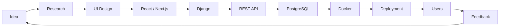
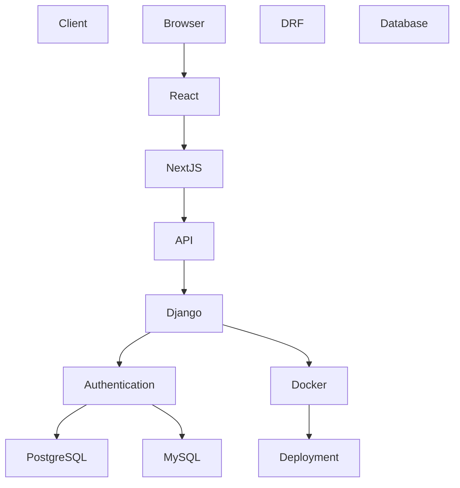
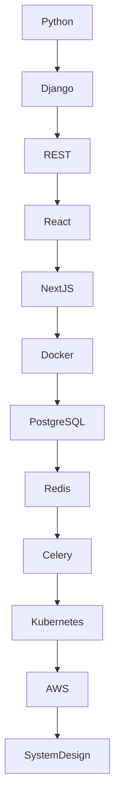

<!-- ========================================================= -->
<!--                     CYBERPUNK README                       -->
<!-- ========================================================= -->

<div align="center">


</div>

---

<div align="center">

#  Welcome to My Digital Universe

</div>

---

<div align="center">


</div>

---

<div align="center">


</div>

---

<div align="center">


</div>

---

# SYSTEM INITIALIZATION

```text
███████████████████████████████████████████

BOOTING CYBER TERMINAL...

Loading Profile...
████████████████████████ 100%

Loading Skills...
████████████████████████ 100%

Connecting GitHub...
████████████████████████ 100%

Connecting Blender...
████████████████████████ 100%

Building Future...
████████████████████████ 100%

SYSTEM STATUS

ONLINE

███████████████████████████████████████████
```

---

<div align="center">

## "Building elegant software one commit at a time."

</div>

---

# WHOAMI

```bash
> whoami

Name        : Aasish Karki

Role        : Full Stack Developer

Frontend    : React.js
              Next.js

Backend     : Django
              Django REST Framework

Language    : Python

Database    : PostgreSQL
              MySQL

Cloud       : Learning...

3D          : Blender

Mission     : Build software that people enjoy using.

Status      : Available for collaboration

Version     : v2026.8
```

---

<div align="center">

<table>

<tr>

<td width="50%">

# ABOUT

```yaml
name: Aasish Karki

location: Nepal

profession:

- Full Stack Developer
- Python Developer
- Blender Artist

currently_learning:

- Docker
- PostgreSQL
- System Design
- Next.js

currently_building:

- Django Applications
- REST APIs
- Interactive UI
- 3D Experiences

interests:

- Open Source
- UI Design
- Architecture
- Backend
```

</td>

<td width="50%">


</td>

</tr>

</table>

</div>

---

<div align="center">

# CYBER STATUS

</div>

<table>

<tr>

<td>

⚡ Backend

███████████████████░ 95%

</td>

<td>

🎨 UI

████████████████░░░ 88%

</td>

</tr>

<tr>

<td>

⚛ React

███████████████░░░░ 82%

</td>

<td>

🐍 Python

██████████████████░ 92%

</td>

</tr>

<tr>

<td>

🟩 Django

███████████████████ 95%

</td>

<td>

🎥 Blender

██████████████░░░░░ 80%

</td>

</tr>

</table>

---

<div align="center">


</div>

# CURRENT MISSION

<table>

<tr>

<td>

✔ Building production Django applications

</td>

<td>

✔ Learning advanced React

</td>

</tr>

<tr>

<td>

✔ Exploring Docker

</td>

<td>

✔ Improving UI Design

</td>

</tr>

<tr>

<td>

✔ PostgreSQL

</td>

<td>

✔ Blender Animations

</td>

</tr>

</table>

---

# DAILY WORKFLOW

```text
          PLAN
            │
            ▼
      DESIGN UI
            │
            ▼
   BUILD BACKEND
            │
            ▼
 CONNECT FRONTEND
            │
            ▼
      TEST APP
            │
            ▼
       DEPLOY
            │
            ▼
     IMPROVE AGAIN
```

---

# DEVELOPMENT PRINCIPLES

> Build clean.

> Build scalable.

> Build beautiful.

> Never stop learning.

> Simplicity beats complexity.

> User Experience comes first.

---

<div align="center">


</div>
<!-- ========================================================= -->
<!--                PART 2 — TECH STACK & ARCHITECTURE         -->
<!-- ========================================================= -->

<div align="center">

# ⚡ TECH ARSENAL

### Carefully chosen technologies for building fast, scalable, and beautiful applications.


</div>

---

<div align="center">

# LANGUAGES

<p>


</p>

</div>

---

<div align="center">

# FRONTEND

<p>


</p>

</div>

---

<div align="center">

# BACKEND

<p>


</p>

</div>

---

<div align="center">

# DATABASES

<p>


</p>

</div>

---

<div align="center">

# DEVOPS & CLOUD

<p>


</p>

</div>

---

<div align="center">

# DESIGN

<p>


</p>

</div>

---

<div align="center">

# FAVORITE TOOLS

| IDE | API | Browser | Terminal |
|:---:|:---:|:---:|:---:|
| VS Code | Postman | Firefox | PowerShell |

</div>

---

<div align="center">

# SKILL MATRIX

</div>

| Technology | Level |
|------------|-------|
| Python | ████████████████████ 95% |
| Django | ████████████████████ 95% |
| REST API | ██████████████████░ 90% |
| React | ████████████████░░░ 82% |
| Next.js | ██████████████░░░░░ 75% |
| PostgreSQL | █████████████░░░░░░ 70% |
| Docker | ███████████░░░░░░░░ 60% |
| Blender | ███████████████░░░░ 80% |
| UI Design | █████████████████░░ 88% |

---

<div align="center">

# DEVELOPMENT ECOSYSTEM

</div>



---

<div align="center">

# FULL STACK ARCHITECTURE

</div>



---

<div align="center">

# GIT WORKFLOW

</div>


---

<div align="center">

# LEARNING ROADMAP

</div>



---

<details>

<summary>

## CURRENTLY LEARNING

</summary>

### Backend

- Docker
- Advanced Django
- PostgreSQL Optimization

### Frontend

- Advanced React
- Next.js App Router
- Performance Optimization

### Architecture

- Microservices
- Caching
- System Design

### DevOps

- Docker Compose
- GitHub Actions
- CI/CD

</details>

---

<details>

<summary>

## PRODUCTIVITY TOOLKIT

</summary>

| Category | Tools |
|-----------|------|
| Editor | VS Code |
| Database | MySQL Workbench |
| API | Postman |
| Design | Blender |
| Version Control | Git |
| Browser | Firefox |
| Notes | Obsidian |

</details>

---

<div align="center">

# CYBERPUNK CHECKLIST

</div>

- ✅ Clean Code
- ✅ Responsive Design
- ✅ RESTful APIs
- ✅ Authentication
- ✅ Database Design
- ✅ Reusable Components
- ✅ Scalable Architecture
- ✅ Version Control
- ✅ Continuous Learning
- 🔄 Exploring Docker
- 🔄 System Design
- 🔄 Cloud Deployment

---

<div align="center">

> "Great software isn't written once—it evolves with every commit."

</div>

---

<div align="center">


</div>
